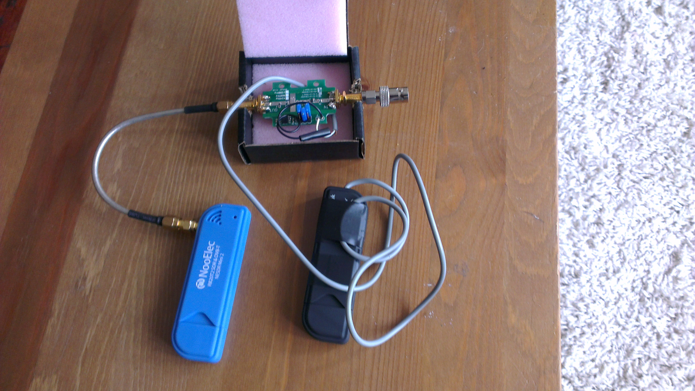

This post describes how to photograph the curvature of the Earth using a space balloon (also called a 'high altitude weather balloon, or 'HAB'), some Canon cameras running CHDK and a lot of internet know-how.

## e3SpaceProgram

A few months ago along with some friends and I set up the #e3SpaceProgram, a project to explore space from the east end of London.

We recently launched our first mission ("Hermes I") and successfully recovered our payload. The journey to our first launch was a long and occasionally difficult one. The end results were absolutely worth it though. I wanted to put together a brief 'how we did it' guide to help anyone else thinking of making the same trip.

## What you need to build and launch a Space Balloon

### The expertise of others

Nothing helps more than the help and guidance of people who have already done what you're trying to do.

In particular, anyone thinking of launching a space balloon should **read [this post](http://www.daveakerman.com/?p=1732) on Dave Akerman's site**. It is comprehensive and draws on a great deal of his (extensive) personal experience.

Below are some links to more pages we continue to find informative and inspirational:

* The [Brooklyn Space Program](http://www.brooklynspaceprogram.org/BSP/Home.html) was the initial inspiration for the e3SpaceProgram.
* The [Global Space Balloon Challenge](https://community.balloonchallenge.org/) was a catalyst for getting the project over the line and a great way to connect with similar projects around the world.
* The [Stratodean Project](http://www.stratodean.co.uk/) – A ‘journey into new space, from the Forrest of Dean’. Lots of useful detail on how they’ve constructed their payload.
* The [Joshing Talk](http://www.joshingtalk.com/) project caught the attention of Richard Branson.
* The guys at [Cambridge University Space Flight](http://www.cusf.co.uk/) certainly know their beans. Check out their website for some impressive footage of rocket launches.
* The [UKHAS](http://ukhas.org.uk/) site has a wealth of information on weather balloon launches. A lot of their articles are quite technical, but required reading especially if you plan to build your own GPS tracker.
* The [#highaltitude IRC channel](http://webchat.freenode.net/?channels=highaltitude) is full of very knowledgeable people who are more than willing to help newcomers.

### A playlist

Handy for playing in the car when you’re chasing your balloon, or for the long hours of getting your payload to work. You can find our Official Spotify Hermes I playlist [here](https://open.spotify.com/user/adam_dynamic/playlist/0q9EXrrIUXbfbJdMwzWZ1n)\*.



\*Questionable song choices, courtesy of [Sarah Day](https://twitter.com/geowriter).

### A (reliable) GPS tracker

Getting a tracker to work and being able to listen and decode the signal reliably was the hardest part of our first launch. As you'll need one if you ever want to see your payload again, it's also one of the most important pieces of the puzzle.

Having first looked at building our own, in the end we decided to let the pros handle it and picked up a [Pi in the Sky](http://www.pi-in-the-sky.com/) ('PITS') tracker board for the popular Raspberry Pi. It's not cheap but it's reliable and as novices we'd rather spend the money than risk losing our payload.

The PITS board comes with the antenna and battery clip. You'll need some [Energizer Lithium batteries](http://www.amazon.co.uk/gp/product/B004G6NYB6/ref=as_li_tl?ie=UTF8&camp=1634&creative=6738&creativeASIN=B004G6NYB6&linkCode=as2&tag=adamd-21&linkId=4W3DV4G7DBE6C3GC) to power it (this type continue to work in the very low temperatures of near space, any other type won't).

The PITS board attaches to a [Raspberry Pi A+](https://www.raspberrypi.org/products/model-a-plus/) (recommended for the flight as it is more power efficient) or a [B+](https://www.raspberrypi.org/products/model-b-plus/) (much less efficient but easier to connect to the internet which you'll need to do in order to set up the PITS). In the end, we bought one of each.

**Note** that the older Raspberry Pi A and B models _will not work_ with the PITS board, the number of pins on the GPIO header (the black bit at the top of the photo above) is different.

### A back-up tracker

Given its crucial role in the mission, it is always a good idea to have a back-up tracker. We used a cheap [LG-E400](http://www.ebay.co.uk/sch/Mobile-Smart-Phones-/9355/i.html?_from=R40&_nkw=LG-E400) android phone with an app that texted you the phone's GPS coordinates when you text it a specific keyword.

Its battery survived the cold of near space and made it back to Earth alive. During our launch we lost radio contact with Hermes I so the back-up android phone was the only reason we managed to recover our payload.

### A radio receiver

Once your balloon is in the air you'll need a way to receive the radio signals transmitted by the PITS tracker. Professional radio receivers are expensive so instead we used [Software Defined Radio (SDR)](http://en.wikipedia.org/wiki/Software-defined_radio) which you can run on your laptop.

We used [this guide](https://ukhas.org.uk/guides:sdr_tracker) on the [UKHAS website](https://ukhas.org.uk/start). It's a long post and **it's worth reading through it two or three times** before getting started. Some of the 'important' steps are buried between the various screenshots, we missed them a few times so read carefully.

There is an additional guide on how to use the dl-fldigi package [here](https://ukhas.org.uk/guides:tracking_guide) (more on what dl-fldigi is below).

#### Hardware

You still need some equipment:

* An antenna to receive the signal. The [Watson WSM-270](http://cpc.farnell.com/watson/wsm-270/wsm-270-mini-mag-antenna/dp/IT44456) is the right wavelength and gave us a good signal.
* A (good quality) tuner dongle. We bought a cheap dongle and it failed almost immediately. We picked up a [NooElec RTL-SDR dongle](http://"http://www.amazon.co.uk/gp/product/B00P2UOU72/ref=as_li_tl?ie=UTF8&camp=1634&creative=19450&creativeASIN=B00P2UOU72&linkCode=as2&tag=adamd-21&linkId=37YUMPF5YTS3XQND") on Amazon - it took a couple of weeks to arrive from America but [NooElec](http://www.nooelec.com/store/) specialise in SDR dongles and it worked reliably.
* A filtered pre-amp to boost the signal. The HABSupplies site has a selection including [this one](http://ava.upuaut.net/store/index.php?route=product/product&path=72_73&product_id=83) which is the correct wavelength and comes in a handy enclosure.
* Some connecting cables to join it all together. A [SMA male to SMA mail pigtail](http://ava.upuaut.net/store/index.php?route=product/product&path=71_66&product_id=60) will connect your pre-amp to your SDR dongle. You will also need [an adaptor](http://uk.rs-online.com/web/p/rf-coaxial-adapters/7619951/) to make it fit the smaller socket on the dongle itself. Finally a [SMA to BNC adaptor](http://uk.rs-online.com/web/p/rf-coaxial-adapters/7619985/) to connect the pre-amp to the antenna.

The e3SpaceProgram SDR set-up. The black SDR dongle on the right was the cheap one that broke. We used it instead to provide 5v power to the pre-amp via the USB plug.

#### Software

You will need to install the following pieces of software. They are all for Windows and all free of charge (these are the packages mentioned in the guides above).

* [SDR Sharp](http://sdrsharp.com/#sdrsharp) is the software that reads the radio signal
* [dl-fldigi](https://github.com/jamescoxon/dl-fldigi/archive/DL3.1.zip) decodes the signal into something readable (the [UKHAS dl-fldigi](https://ukhas.org.uk/projects:dl-fldigi) page has alternatives for Apple, Linux etc)
* [Virtual audio cable](http://vb-audio.pagesperso-orange.fr/Cable/index.htm) connects the two packages together.

### Some cameras to capture the journey

For our first payload, we used two [Canon A560](http://www.ebay.co.uk/sch/Digital-Cameras-/31388/i.html?_from=R40&_nkw=canon+a560) cameras that we picked up on eBay, both powered with [Energizer Lithium AA batteries](http://www.amazon.co.uk/gp/product/B004G6NYB6/ref=as_li_tl?ie=UTF8&camp=1634&creative=6738&creativeASIN=B004G6NYB6&linkCode=as2&tag=adamd-21&linkId=4W3DV4G7DBE6C3GC) (again, because they work in low temperatures).

(A lot of people use [GoPro cameras](http://www.amazon.co.uk/s/ref=as_li_ss_tl?_encoding=UTF8&camp=1634&creative=19450&field-keywords=gopro&linkCode=ur2&sprefix=gopro%2Caps&tag=adamd-21&url=search-alias%3Daps) which are well built and reliable. The heavy fish eye distortion of the lens isn't to everyone's taste though and they can be expensive, especially as you may never see it again).

The A560s were running the [Canon Hackers Development Kit (CHDK)](http://chdk.wikia.com/wiki/CHDK) firmware. This is a non-permanent, non-destructive program that runs on the camera itself, giving you a wide range of user options not normally available. We installed CHDK on [4GB SD cards](http://www.amazon.co.uk/gp/product/B007JELV1M/ref=as_li_tl?ie=UTF8&camp=1634&creative=6738&creativeASIN=B007JELV1M&linkCode=as2&tag=adamd-21&linkId=SOURY46AW6XTMDX4) using the [Simple Tool for Installing CHDK ('STICK')](http://zenoshrdlu.com/stick/stick.html).

A key feature of CHDK is the ability to load and run scripts. We used the excellent [KAP UAV Exposure Control Script](http://chdk.wikia.com/wiki/KAP_UAV_Exposure_Control_Script) from the CHDK site. It is designed with this type of activity in mind and works well on the Canon A560.

With this type of firmware hack, different cameras respond in different ways and each have their own little issues. We posted whatever small bugs we found on the [dedicated CHDK forum page](http://chdk.setepontos.com/index.php?topic=10822) for the script and always got a helpful response.

#### The camera settings

We wanted to take as many high-quality photos as possible during the flight. Your own experimentation is important but in terms of our first steps, to configure the A560s:

1. Set the wheel on the top to **AUTO** (makes sure the CHDK script behaves responsibly)
2. To save battery, in the standard (non-CHDK) shooting menu:
  * Red-Eye: off
  * AF-assist Beam: off
  * Review: off
3. **Turn off the camera flash** (this is important and you'll need to do it manually every time you turn the camera on)

Configuration of the [CHDK script](http://chdk.wikia.com/wiki/KAP_UAV_Exposure_Control_Script) on some of the key attributes:

#### 'Side' camera

- Shot interval: 10 seconds
- Timeout: 0
- Total Shots: 0 (infinite)
- Tv Min: 1/60
- Target TV: 1/200\*
- Tv Max: 1/2000
- Zoom position: 0%
- Focus @ Infinity: True
- Video Interleave (shots): 10
- Video Duration (sec): 10
- Backlight Off?: True

The image quality was set as **Large/Superfine** (the highest quality available)

\* The payload twists and moves around quite a bit during the flight. A fast target shutter speed is essential to ensuring your photos look sharp.

#### 'Up' camera

- Shot interval: 2 seconds
- Timeout: 0
- Total Shots: 0 (infinite)
- Tv Min: 1/60
- Target TV: 1/200
- Tv Max: 1/2000
- Zoom position: 0%
- Focus @ Infinity: False\*\*
- Video Interleave (shots): Off
- Backlight Off?: True

The image quality was set to **Medium 2/Fine**\*\*\*

\*\* I set the focus length using the Override Subject Difference setting in the Enhanced Photo Operations CHDK menu to the total length of the cord between the payload and the balloon.

\*\*\* A lower quality than the side camera. The reason for this is I wanted to capture the moment the balloon burst so set the shot interval to be as low as possible. More shots = more memory so I needed to make each image smaller. The first shot of the balloon bursting was worth it though (top of the post).

### The payload itself

The payload for Hermes I was a 2.7L Polystyrene Box we picked up from the [Random Aerospace](http://randomaerospace.com/Random_Aerospace/Stuff.html) site. It's important that nothing moves around inside the payload as the launch and balloon burst can be pretty violent events (the 'rule of thumb' is that you should be able to drop your payload down some stairs).

We created partitions using [25mm Styrofoam sheets](http://www.hindleys.com/index.php/materials/plastics-foam/sheet/styrofoam-high-density-polystyrene-foam/styrofoam-sheet-600mm-x-1245mm-x-25mm.html) to make sure everything stayed put during the mission.



### Miscellaneous items

Various small items that turned out to be essential included:

* A [black sharpie marker](http://www.amazon.co.uk/gp/product/B001AM2J9M/ref=as_li_tl?ie=UTF8&camp=1634&creative=19450&creativeASIN=B001AM2J9M&linkCode=as2&tag=adamd-21&linkId=BCXQ2JUAQWKM2X2R)
* [Gaffer tapes](http://www.amazon.co.uk/gp/product/B00BQH2GOY/ref=as_li_tl?ie=UTF8&camp=1634&creative=19450&creativeASIN=B00BQH2GOY&linkCode=as2&tag=adamd-21&linkId=RAKRMWYBC3ZFMBWK) (lots of it)
* [Cable ties](http://www.amazon.co.uk/gp/product/B005M1LR7W/ref=as_li_tl?ie=UTF8&camp=1634&creative=19450&creativeASIN=B005M1LR7W&linkCode=as2&tag=adamd-21&linkId=XD2O2JDVDYSTY2TT) (lots of them)
* A [Stanley knife](http://www.amazon.co.uk/gp/product/B0001GRVE6/ref=as_li_tl?ie=UTF8&camp=1634&creative=19450&creativeASIN=B0001GRVE6&linkCode=as2&tag=adamd-21&linkId=VLXCXUNFOLRDPYLA) (very sharp so please be careful and get adult supervision if you need it)
* A [safety ruler](http://www.amazon.co.uk/gp/product/B002KLRA82/ref=as_li_tl?ie=UTF8&camp=1634&creative=19450&creativeASIN=B002KLRA82&linkCode=as2&tag=adamd-21&linkId=BP5OIZKZCSZU3Z5U) (to help with the cutting)
* Thick cardboard (we used cardboard boxes)
* Bright orange card/paper (to make the payload easy to spot in a field)
* [Drinking straws](http://www.amazon.co.uk/gp/product/B005G3GTD8/ref=as_li_tl?ie=UTF8&camp=1634&creative=19450&creativeASIN=B005G3GTD8&linkCode=as2&tag=adamd-21&linkId=X3XHU2LL5XY5MFFT) (used when [making the antenna](https://ukhas.org.uk/guides:payload_antenna) out of the cable you get with the PITS for example)
* A cheap pair of black socks (for the camera holes in the payload to minimise glare from the payload)

### A space balloon, a parachute and some nylon chord

Because the size and type of [balloon](http://randomaerospace.com/Random_Aerospace/Balloons.html) and [parachute](http://randomaerospace.com/Random_Aerospace/Parachutes.html) you need will depend on the weight of your payload, it's actually best to buy them last. As with the payload, we got ours from [Random Aerospace](http://randomaerospace.com/Random_Aerospace/Welcome.html) whose site also includes a handy calculator for determining what size you need. Finally, you'll need some [nylon cord](http://randomaerospace.com/Random_Aerospace/Stuff.html) to attach everything together.

## Things we'd do differently next time

### 1) Take your time on launch day

We ended up rushing around on the launch day more than I would have liked (as this tends to be how mistakes are made). We forgot initially to pack the back-up tracker, when we realised we re-packed the payload but in our haste, possibly broke the primary tracker.

**Lesson:** Make a list of specific tasks to do, take your time following it, periodically take a 'step back' and reflect on whether you're overlooking anything.

### 2) Trigger the camera scripts externally

The cameras were packed tightly into the payload so we had to 'guesstimate' a delay time on the CHDK script. The 'hurry up and wait' nature of the launch meant my concerns about battery life and the capacity of the SD cards caused me to rush (see point 1).

Being able to trigger the scripts once everything was packed and ready for launch would have mitigated this risk.

**Lesson:** Safely recovering your payload is more important than how many photos you take.

### 3) When in doubt, buy the bigger pack

Whenever faced with the decision of what size of something to buy for your first space balloon, buy a size bigger than you think you need. This applies particularly to gaffer tape and cable ties.

**Lesson:** No roll of gaffer tape is 'too big' for space exploration.

## The results

The curvature of the Earth :)



### Go for launch?

Hopefully the above guide helps you get started on your first mission. Please feel to get in touch if you have any questions - we're more than happy to help anyone take their first steps into space :)

[@AdamDynamic](https://twitter.com/AdamDynamic)

[@e3SpaceProgram](https://twitter.com/e3spaceprogram)
